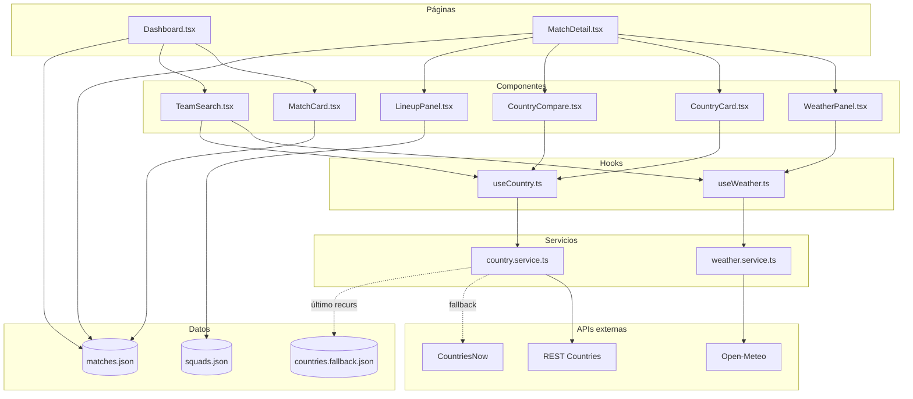

# Manual Técnico — Dashboard Mundial 2026

## Arquitectura

La aplicación es una SPA (Single Page Application) sin backend: el calendario
de partidos vive en un JSON estático y los datos dinámicos provienen de dos
APIs REST públicas. La capa de servicios aísla las llamadas de red; los hooks
de TanStack Query gestionan caché y estados; los componentes solo presentan.



**Flujo de datos.** Una página carga `matches.json` y lo pasa a sus
componentes. Cuando un componente necesita clima o datos de país, invoca el
hook correspondiente; el hook llama al servicio, que consulta la API y
transforma la respuesta cruda en un modelo limpio (`DayWeather` o
`CountryInfo`). TanStack Query cachea cada resultado por su `queryKey`, de modo
que el mismo país o la misma sede no se vuelven a pedir durante la sesión.

## APIs externas

### Open-Meteo

URL base: `https://api.open-meteo.com/v1/forecast`

| Parámetro | Descripción |
|---|---|
| `latitude`, `longitude` | Coordenadas de la sede |
| `daily` | Variables diarias solicitadas (temp. máx/mín, lluvia, viento, código WMO) |
| `hourly` | `relative_humidity_2m` para la humedad a la hora del partido |
| `timezone` | Zona IANA de la sede |
| `start_date`, `end_date` | Misma fecha: el día del partido |

Ejemplo de respuesta real (recortada):

```json
{
  "latitude": 19.3032,
  "longitude": -99.1506,
  "timezone": "America/Mexico_City",
  "daily": {
    "time": ["2026-06-11"],
    "temperature_2m_max": [24.3],
    "temperature_2m_min": [13.1],
    "precipitation_probability_max": [55],
    "windspeed_10m_max": [17.2],
    "weathercode": [80]
  }
}
```

### REST Countries

URL base: `https://restcountries.com/v3.1`

| Parámetro | Descripción |
|---|---|
| `/alpha/{código}` | Búsqueda por código ISO-3166-1 alfa-3 |
| `/name/{nombre}` | Búsqueda por nombre |
| `?fields=` | Lista de campos a devolver, para reducir el tamaño de la respuesta |

Ejemplo de respuesta real (recortada):

```json
[
  {
    "name": { "common": "Mexico", "official": "Estados Unidos Mexicanos" },
    "cca3": "MEX",
    "capital": ["Mexico City"],
    "region": "Americas",
    "subregion": "North America",
    "languages": { "spa": "Spanish" },
    "currencies": { "MXN": { "name": "Mexican peso", "symbol": "$" } },
    "population": 128932753,
    "timezones": ["UTC-08:00", "UTC-07:00", "UTC-06:00"]
  }
]
```

### CountriesNow (fallback)

URL base: `https://countriesnow.space/api/v0.1`

Se usa solo si REST Countries no responde (problemas de CORS o caídas).
Aporta capital, moneda y población; los campos que no entrega (región,
idiomas, zonas horarias) se completan con el dataset local. Ver la sección
**Configuración de CORS**.

## Estructura de datos

### matches.json

| Campo | Tipo | Descripción |
|---|---|---|
| `matchId` | number | Identificador único del partido (1–72) |
| `phase` | string | `"group"` para todos los partidos de fase de grupos |
| `group` | string | Letra del grupo: `"A"` … `"L"` |
| `date` | string | Fecha ISO 8601: `"2026-06-11"` |
| `timeLocal` | string | Hora local de la sede en formato `HH:MM` |
| `timezone` | string | Zona horaria IANA, ej. `"America/Chicago"` |
| `venueName` | string | Nombre del estadio |
| `city` | string | Ciudad de la sede |
| `country` | string | País sede (`US`, `MX` o `CA`) |
| `latitude` | number | Latitud de la sede para Open-Meteo |
| `longitude` | number | Longitud de la sede para Open-Meteo |
| `teamA` | string | Código alfa-3 del equipo local, ej. `"FRA"` |
| `teamB` | string | Código alfa-3 del equipo visitante |
| `teamAName` | string | Nombre en español del equipo A |
| `teamBName` | string | Nombre en español del equipo B |

Objeto de ejemplo:

```json
{
  "matchId": 1,
  "phase": "group",
  "group": "A",
  "date": "2026-06-11",
  "timeLocal": "13:00",
  "timezone": "America/Mexico_City",
  "venueName": "Estadio Azteca",
  "city": "Ciudad de México",
  "country": "MX",
  "latitude": 19.3032,
  "longitude": -99.1506,
  "teamA": "MEX",
  "teamB": "ZAF",
  "teamAName": "México",
  "teamBName": "Sudáfrica"
}
```

> **Nota sobre la cantidad de partidos.** La fase de grupos del Mundial 2026
> tiene 12 grupos de 4 equipos que juegan 3 partidos cada uno: 48 × 3 ÷ 2 = **72
> partidos**, no 64. El sistema implementa los 72 oficiales.

## Componentes

### MatchCard

Tarjeta de partido en el listado del dashboard.

| Prop | Tipo | Requerido | Descripción |
|---|---|---|---|
| `match` | `Match` | Sí | Partido a mostrar |
| `now` | `Date` | Sí | Instante actual compartido, para el estado dinámico |
| `onSelect` | `(match: Match) => void` | No | Callback al hacer clic en la tarjeta |

Responsabilidad: presentar grupo, estado, selecciones con bandera, fecha y
horas. Dependencias: `getMatchStatus`, `getGuatemalaTime`, `getFlagUrl`.

### WeatherPanel

Panel de clima de la sede en el detalle.

| Prop | Tipo | Requerido | Descripción |
|---|---|---|---|
| `match` | `Match` | Sí | Partido cuyo clima se consulta |

Responsabilidad: mostrar temperatura, condición, humedad, viento, lluvia y la
recomendación contextual. Dependencias: `useWeather`, `describeWeatherCode`.

### CountryCard

Ficha informativa de un país.

| Prop | Tipo | Requerido | Descripción |
|---|---|---|---|
| `code` | `string` | Sí | Código alfa-3 / FIFA del país |
| `teamName` | `string` | Sí | Nombre en español, para el encabezado |

Responsabilidad: bandera, nombre oficial, capital, región, idiomas, moneda,
población y zona horaria. Dependencias: `useCountry`, `getFlagUrl`.

### CountryCompare

Comparador lado a lado de los dos países del partido.

| Prop | Tipo | Requerido | Descripción |
|---|---|---|---|
| `match` | `Match` | Sí | Partido cuyos dos países se comparan |

Responsabilidad: tabla comparativa y diferencia de población (absoluta y
porcentual). Dependencias: `useCountry`, `getFlagUrl`.

### TeamSearch

Búsqueda por equipo en el dashboard.

| Prop | Tipo | Requerido | Descripción |
|---|---|---|---|
| (sin props) | — | — | Lee el catálogo de equipos desde `matches.json` |

Responsabilidad: autocompletar selecciones, mostrar la ficha del país elegido y
sus partidos con resumen de clima. Dependencias: `useWeather`, `useCountry`,
`CountryCard`, `describeWeatherCode`, `getFlagUrl`, `getGuatemalaTime`.

### LineupPanel

Alineaciones probables de ambos equipos.

| Prop | Tipo | Requerido | Descripción |
|---|---|---|---|
| `teamA` | `string` | Sí | Código del equipo local |
| `teamAName` | `string` | Sí | Nombre del equipo local |
| `teamB` | `string` | Sí | Código del equipo visitante |
| `teamBName` | `string` | Sí | Nombre del equipo visitante |

Responsabilidad: mostrar el XI por posiciones desde `squads.json`, o un estado
vacío si el equipo aún no tiene alineación cargada.

## Hooks personalizados

### useWeather

```ts
function useWeather(
  match: Match | undefined,
): UseQueryResult<DayWeather, Error>;
```

- **Parámetros:** el partido (o `undefined` mientras carga).
- **Retorno:** objeto de TanStack Query con `data`, `isLoading`, `isError`,
  `error` y `refetch`.
- **Caché:** clave `['weather', lat, lon, date]`, `staleTime` de 30 minutos.

Ejemplo de uso:

```ts
const { data, isLoading, isError } = useWeather(match);
if (isLoading) return <Spinner />;
if (isError) return <ErrorBox />;
return <p>{data.tempMax}°C</p>;
```

### useCountry

```ts
function useCountry(
  code: string | undefined,
): UseQueryResult<CountryInfo, Error>;

function useCountrySearch(
  name: string,
): UseQueryResult<CountryInfo, Error>;
```

- **Parámetros:** `useCountry` recibe el código alfa-3; `useCountrySearch`
  recibe un nombre y solo dispara con 3+ caracteres.
- **Retorno:** objeto de TanStack Query con la ficha del país.
- **Caché:** `staleTime: Infinity` (los datos de un país no cambian en la
  sesión).

Ejemplo de uso:

```ts
const { data, isLoading } = useCountry(match.teamA);
if (data) console.log(data.capital, data.population);
```

## Instalación local

Prerrequisitos: Node.js 18 o superior y npm 9 o superior.

```bash
# 1. Clonar el repositorio
git clone https://github.com/TU-USUARIO/mundial-2026-dashboard.git
```

```bash
# 2. Entrar a la carpeta e instalar dependencias
cd mundial-2026-dashboard
npm install
```

```bash
# 3. Ejecutar en modo desarrollo
npm run dev
```

```bash
# 4. Abrir en el navegador
# http://localhost:5173
```

## Despliegue en Render.com

```bash
# 1. Subir el proyecto a GitHub
git add .
git commit -m "deploy: versión para producción"
git push origin main
```

```bash
# 2. En Render: New + → Static Site → conectar el repositorio
#    Build Command:     npm install && npm run build
#    Publish Directory: dist
```

```bash
# 3. Agregar la regla de rewrite para la SPA (Redirects/Rewrites):
#    Source: /*   Destination: /index.html   Action: Rewrite
```


## Configuración de CORS

**Problema.** REST Countries deshabilita CORS para algunos dominios de
producción. En Render, las fichas de países pueden fallar con un error de CORS
en la consola del navegador.

**Solución en desarrollo:** proxy en `vite.config.ts` que redirige
`/api/countries` a la API, evitando el origen cruzado.

```ts
export default defineConfig({
  plugins: [react()],
  server: {
    proxy: {
      '/api/countries': {
        target: 'https://restcountries.com/v3.1',
        changeOrigin: true,
        rewrite: (path) => path.replace(/^\/api\/countries/, ''),
      },
    },
  },
});
```

**Solución en producción:** el servicio intenta una cascada de fuentes —
proxy (dev) → URL directa → CountriesNow → dataset local
`countries.fallback.json`. Así la ficha del país nunca queda vacía aunque
REST Countries falle.

## Troubleshooting

### Error: `Cannot find module 'react-router-dom'`
**Causa:** dependencias no instaladas o instalación incompleta.
**Solución:**
```bash
rm -rf node_modules package-lock.json
npm install
```

### Error: `404 Not Found` al refrescar en /partido/5 (en Render)
**Causa:** falta la regla de rewrite de la SPA; el servidor busca un archivo
físico que no existe.
**Solución:**
```bash
# En Render → Redirects/Rewrites:
# Source: /*   Destination: /index.html   Action: Rewrite
```

### Error: ficha de país con campos vacíos (región, idiomas en blanco)
**Causa:** REST Countries no respondió y el sistema cayó al fallback, que
entrega menos campos.
**Solución:**
```bash
# Verificar en la consola del navegador (F12) qué nivel respondió.
# Recargar con caché limpio para reintentar la fuente principal:
# Ctrl + Shift + R
```

### Error: `out of allowed range` en el panel de clima
**Causa:** la fecha del partido está a más de 16 días; Open-Meteo solo publica
pronóstico hasta ese horizonte.
**Solución:**
```bash
# No requiere acción: el sistema muestra un mensaje informativo.
# El clima aparecerá automáticamente al acercarse la fecha del partido.
```

### Error: `npm run build` falla por tipos de TypeScript
**Causa:** errores de tipado que `tsc` detecta antes de compilar.
**Solución:**
```bash
# Ver el detalle de los errores:
npx tsc --noEmit
# Corregir los archivos señalados y volver a construir:
npm run build
```

### Error: la página queda en blanco tras el build
**Causa:** rutas de assets incorrectas o `base` mal configurada en Vite.
**Solución:**
```bash
# Probar el build localmente antes de desplegar:
npm run build
npm run preview
# Abrir http://localhost:4173 y revisar la consola del navegador.
```
