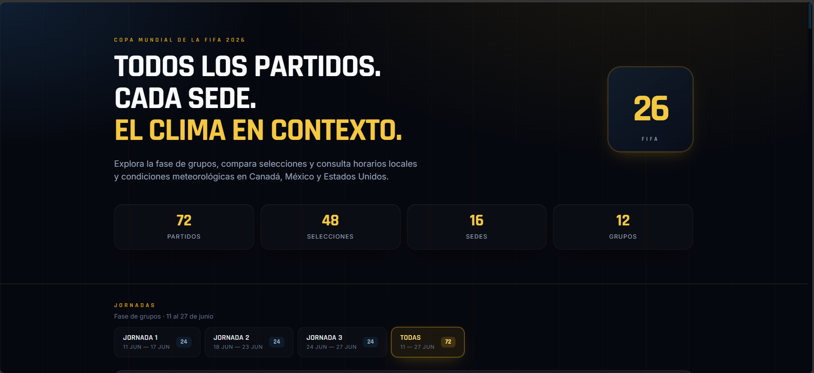
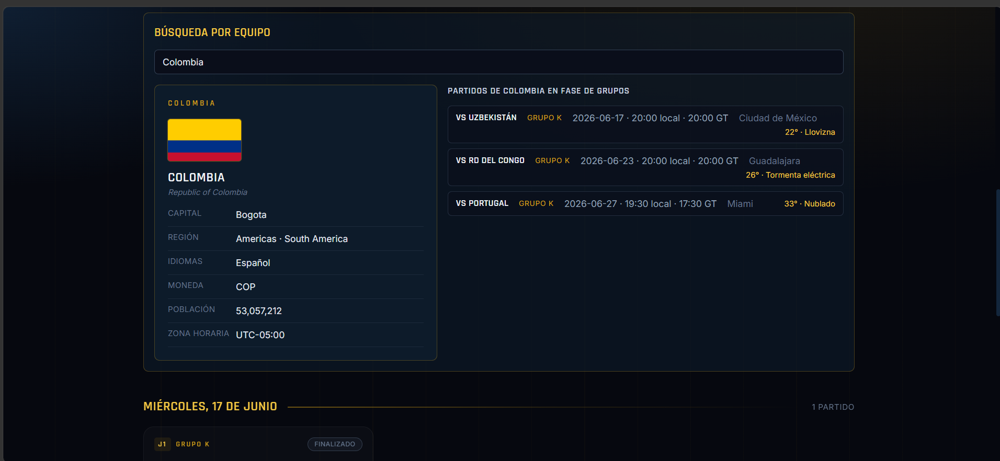

# Dashboard Mundial 2026: Clima, Sedes y Países

## Introducción

El Dashboard Mundial 2026 es una aplicación web que reúne, en un solo lugar,
toda la información de contexto de los partidos de la fase de grupos del
Mundial FIFA 2026: cuándo y dónde se juega cada encuentro, qué clima se espera
en la sede y quiénes son las selecciones que se enfrentan.

**Problema que resuelve.** La información de un partido suele estar dispersa:
el calendario en un sitio, el clima en otro, los datos de cada país en un
tercero. Este sistema la consolida y la presenta de forma clara, incluyendo la
conversión automática de horarios a la hora de Guatemala, para que cualquier
aficionado pueda planificar qué partidos seguir sin saltar entre páginas.

**Usuario objetivo.** Aficionados al fútbol en Guatemala y Centroamérica que
quieren consultar el calendario, el clima de cada sede y datos de las
selecciones de forma rápida; no se requieren conocimientos técnicos.

## Requisitos

- **Navegador compatible:** cualquier navegador moderno actualizado (Chrome,
  Edge, Firefox o Safari en sus versiones recientes).
- **Conexión a internet:** necesaria para consultar el clima (Open-Meteo) y los
  datos de países (REST Countries) en tiempo real.
- **URL pública:** el sistema está disponible en línea, sin instalación, en
  [https://mundial-2026-dashboard.onrender.com](https://mundial-2026-dashboard.onrender.com).

## Guía de la interfaz

### Dashboard principal

Es la pantalla de inicio. Muestra los 72 partidos de la fase de grupos
agrupados por jornada, con una franja superior de métricas (partidos, grupos,
selecciones y estadios). Cada partido aparece como una tarjeta.

### Tarjeta de partido

Cada tarjeta resume un encuentro: el grupo, el estado (Próximo, En curso o
Finalizado), las dos selecciones con su bandera, la fecha, la hora local de la
sede, la hora de Guatemala y el estadio. Al hacer clic se abre el detalle.

### Vista de detalle del partido

Al seleccionar un partido se muestran: los datos de la sede con coordenadas,
los tres horarios (local, zona de la sede y Guatemala), el panel de clima, las
fichas de ambos países, el comparador y las alineaciones probables.

### Panel de clima

Muestra la temperatura máxima y mínima del día del partido, la condición
climática con un ícono, la humedad a la hora del encuentro, el viento, la
probabilidad de lluvia y una recomendación contextual.

## Cómo usar el sistema

### Filtros

1. En el dashboard, ubica la barra de filtros en la parte superior.
2. Selecciona un **Grupo** (A–L), una **Sede**, un **Equipo** o una **Fecha**.
3. Los filtros se combinan entre sí; el contador indica cuántos partidos
   coinciden ("Mostrando X de 72").
4. Pulsa **Limpiar** para volver a ver todos los partidos.

### Búsqueda por equipo

1. Escribe el nombre de un país (o su código, por ejemplo `FRA`) en el campo
   **Búsqueda por equipo**.
2. Elige una selección de la lista de sugerencias.
3. El sistema muestra la ficha del país y todos sus partidos de fase de grupos,
   cada uno con sede, fecha, hora y un resumen del clima.
4. Haz clic en cualquier partido para abrir su detalle completo.

### Comparador de países

1. Abre el detalle de cualquier partido.
2. Localiza la sección **Comparador**.
3. Verás una tabla lado a lado con población, región, idiomas, moneda y zona
   horaria de ambas selecciones, más la diferencia de población en valor
   absoluto y porcentaje.

## Interpretación del clima

El sistema genera una recomendación automática según el pronóstico:

| Ícono | Condición | Descripción | Recomendación |
|---|---|---|---|
| ☀️ | Favorable | Sin lluvia y temperatura menor a 30 °C | Clima favorable para el partido |
| 🌡️ | Calor | Temperatura mayor o igual a 30 °C | Temperatura alta — condiciones exigentes |
| 🌧️ | Lluvia | Probabilidad de lluvia mayor o igual a 40 % | Posible lluvia durante el partido |
| ⛈️ | Adverso | Lluvia mayor o igual a 70 % y viento mayor a 40 km/h | Condiciones adversas |

## Glosario

- **Código WMO** — número estándar de la Organización Meteorológica Mundial que
  identifica una condición del clima (despejado, lluvia, tormenta, etc.).
- **Estado del partido** — etiqueta que cambia sola según la fecha y hora
  actual: Próximo, En curso o Finalizado.
- **Fase de grupos** — primera etapa del Mundial, con 12 grupos de 4
  selecciones que juegan 3 partidos cada una.
- **Hora local de la sede** — hora del partido en la zona horaria del estadio.
- **Hora de Guatemala (UTC-6)** — la misma hora convertida a la zona de
  Guatemala, para saber a qué hora verlo desde el país.
- **Sede** — estadio donde se disputa el partido, con su ciudad y coordenadas.
- **UTC-6** — huso horario de Guatemala (seis horas menos que el meridiano de
  referencia).
- **Zona horaria IANA** — identificador estándar de zona horaria, por ejemplo
  `America/Mexico_City`.
